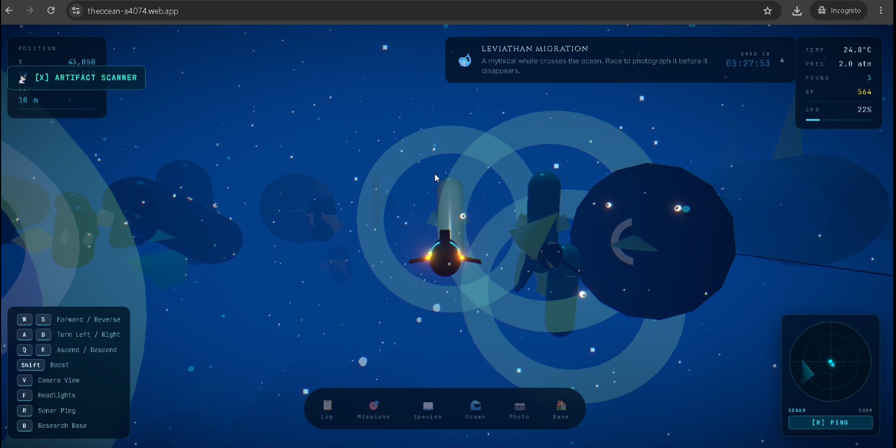

# 🌊 The Unknown Ocean  [Live](https://theocean-a4074.web.app/)

> **Dive into the unknown. Discover what no one has found.**

 
<video src="content/ocean.mp4" width="600" controls></video>

The Unknown Ocean is an immersive browser-based 3D underwater exploration experience built around curiosity, discovery, and procedural exploration.

Pilot your submarine through a vast ocean, encounter procedurally generated marine life, scan unknown species, investigate mysteries, recover artifacts, complete research missions, and uncover what lies beneath the surface.

The goal is simple:

**Every dive should reveal something new.**

---

## ✨ Features

### 🌊 Immersive 3D Ocean

- Fully interactive underwater environment
- Smooth submarine movement
- Third-person and first-person camera modes
- Dynamic depth-based atmosphere
- Underwater particles, god rays, caustics, and bioluminescence
- Multiple ocean biomes with distinct visual identities
- Dynamic ocean events that affect the world

### 🐠 Procedural Wildlife

The ocean is populated by procedurally generated creatures with unique characteristics.

Each creature can have:

- Unique DNA
- Different body archetypes
- Rarity levels
- Colors and glow properties
- Different sizes
- Different movement speeds
- Different behaviours
- Biome-specific characteristics

#### Creature Archetypes

- 🐟 Fish
- 🪽 Ray
- 🐍 Eel
- 🪼 Jellyfish
- 🦑 Cephalopod
- 🐋 Leviathan

#### Rarity System

| Rarity | Approx. Spawn Rate |
|--------|--------------------|
| Common | 60% |
| Uncommon | 25% |
| Rare | 10% |
| Epic | 4% |
| Legendary | 0.9% |
| Mythical | 0.1% |

Rare creatures have unique visual effects and provide greater research rewards.

---

## 🧠 Intelligent Wildlife

Creatures are not simply static objects.

The wildlife system includes behaviour-driven movement such as:

- Schooling
- Predator-prey interactions
- Shy behaviour
- Curious behaviour
- Territorial behaviour
- Sleeping behaviour
- Migrating behaviour
- Scavenging

Creatures react to the submarine and to other creatures in their environment.

---

## 🔬 Research & Discovery

Every expedition can contribute to your research archive.

### Scan creatures

Approach an unknown species and scan it to:

1. Identify the creature
2. Generate its species information
3. Add it to your research log
4. Earn Research Points
5. Unlock progression

First-ever discoveries can also be named by the player.

---

## 🛰️ Sonar Exploration

Use the submarine's sonar system to investigate your surroundings.

Press **R** to send a sonar pulse.

The sonar can reveal:

- Nearby creatures
- Rare species
- Mysteries
- Points of interest

Returns appear on the sonar minimap and gradually fade away, encouraging exploration rather than giving away exact locations.

---

## 🏛️ Hidden Mysteries

The ocean contains procedurally generated locations waiting to be discovered.

Possible discoveries include:

- Ancient ruins
- Abandoned laboratories
- Shipwrecks
- Giant fossils
- Alien obelisks
- Ghost submarines
- Mysterious eggs

Each mystery can contain lore and potential rewards.

---

## 🏺 Artifact System

Discover and recover artifacts scattered throughout the ocean.

Artifacts include:

- Fossils
- Journals
- Scientific equipment
- Pearls
- Sculptures
- Relics

Artifacts can be detected using the **Artifact Scanner** and tracked using navigation waypoints.

---

## 📡 Artifact Scanner

Press **X** to activate the Artifact Scanner.

The scanner provides:

- Detection range
- Artifact rarity filtering
- Direction indicator
- Distance estimation
- Depth offset
- Signal strength
- Navigation waypoint support

Scanner upgrades can increase its range and allow detection of rarer artifacts.

---

## 📸 Photography

Document the wildlife you encounter.

Photography scoring considers factors such as:

- Creature rarity
- Distance
- Number of creatures
- Behaviour
- Composition

High-quality photographs can earn additional Research Points and become part of your research gallery.

---

## 🌌 Dynamic Ocean Events

The ocean can host special events that change the environment and gameplay.

Examples include:

### 🐋 Leviathan Migration

A massive legendary creature travels through the ocean.

### 🦑 Giant Squid Hunt

A mythical predator appears and hunts through the deep.

### 🪼 Glowing Bloom

A large swarm of glowing jellyfish fills the surrounding waters.

### 🌑 Lunar Eclipse

The underwater environment becomes darker and more mysterious.

### 🌀 Abyss Portal

A strange portal and geological structure appear in the ocean.

### ☄️ Meteor Impact

A mysterious impact site appears with glowing fragments.

### 🏛️ Temple Awakening

An ancient underwater structure emerges as part of a world event.

### 🐋 Whale Choir

A special event that increases leviathan encounters and changes the atmosphere of the expedition.

---

## 🧪 Biomes

The ocean is divided into multiple procedural biomes.

Current biome types include:

- 🪸 Coral
- 🌿 Kelp
- 💎 Crystal
- 🌑 Abyss
- ❄️ Frozen
- 🌋 Hydrothermal
- 🏛️ Ruins
- 🌊 Open Ocean

Each biome can influence:

- Creature types
- Creature colours
- Creature behaviours
- Rarity
- Lighting
- Fog
- Particles
- Environmental decorations
- Terrain appearance

---

## 🎯 Research Missions

Daily missions provide objectives for each expedition.

Examples include:

- Photograph a rare species
- Scan creatures in the abyss
- Explore a specific biome
- Find creatures with specific characteristics
- Reach a certain depth
- Discover specific behaviours

Completing missions rewards Research Points and encourages different styles of exploration.

---

## 📈 Research Progression

Exploration earns **Research Points (RP)**.

RP can be used to upgrade submarine equipment.

Current upgrade categories include:

- Sonar
- Camera
- Headlights
- Pressure Hull
- Artifact Scanner

Progression allows deeper and more capable expeditions.

---

## 🏠 Research Base

The Research Base acts as the player's central research hub.

It provides access to:

- Research Lab
- Species Archive
- Mission Board
- World Map
- Photography Gallery
- Artifact Vault
- Submarine Hangar
- Equipment upgrades

---

## 🗺️ World Map

The Research Base contains a world map that tracks exploration and discoveries.

It can display:

- Biomes
- Player position
- Global exploration statistics
- Mysteries
- Artifacts
- Event locations
- Discovery progress

---

## 🌍 Persistent Exploration

The world uses deterministic procedural generation.

This means that the same world coordinates consistently generate the same procedural content.

Creature identities, world content, and other discoveries are seeded from world/chunk coordinates.

The result is a persistent-feeling ocean without requiring a backend server.

---

# 🎮 Controls

| Key | Action |
|-----|--------|
| `W` / `S` | Forward / Reverse |
| `A` / `D` | Turn Left / Right |
| `Q` / `E` | Ascend / Descend |
| `Shift` | Boost |
| `V` / `C` | Change Camera |
| `F` | Toggle Headlights |
| `R` | Sonar Ping |
| `X` | Artifact Scanner |
| `B` | Research Base |

---

# ⚙️ Technology Stack

### Frontend

- React
- TypeScript
- Vite

### 3D & Graphics

- Three.js
- React Three Fiber
- WebGL
- GLSL shaders
- Post-processing

### State Management

- Zustand
- Zustand Persist
- LocalStorage

### Procedural Systems

- Seeded procedural generation
- Noise-based world generation
- Deterministic chunk generation
- Procedural creature DNA
- Procedural mysteries
- Procedural artifacts

---

# 🏗️ Architecture

```text
src/
│
├── App.tsx
├── main.tsx
│
├── scenes/
│   ├── LandingScene.tsx
│   ├── DiveTransition.tsx
│   └── OceanScene.tsx
│
├── components/
│   ├── ocean3d/
│   │   ├── Hero.tsx
│   │   ├── Creature3D.tsx
│   │   ├── CreatureManager.tsx
│   │   ├── Terrain3D.tsx
│   │   ├── UnderwaterAtmosphere.tsx
│   │   ├── BiomeDecor.tsx
│   │   ├── MysteryManager.tsx
│   │   ├── ArtefactManager.tsx
│   │   └── ...
│   │
│   ├── ui/
│   │   ├── HUD.tsx
│   │   ├── ScanHUD.tsx
│   │   ├── ArtifactSignalHUD.tsx
│   │   └── ...
│   │
│   └── panels/
│       ├── ResearchBase.tsx
│       ├── Encyclopedia.tsx
│       ├── ResearchLog.tsx
│       ├── MissionBoard.tsx
│       └── ...
│
├── engine/
│   ├── events/
│   ├── missions/
│   ├── performance/
│   ├── photography/
│   ├── procedural/
│   └── terrain/
│   │
│   └── events/
│       └── dailyEvents.ts
│
└── store/
    ├── useAppStore.ts
    ├── usePlayerStore.ts
    └── useWorldStore.ts


---

# 🚀 Performance

Because the entire experience runs in the browser, performance was a major engineering challenge.

The project uses several techniques to keep the 3D environment responsive:

* Chunk-based creature streaming
* 5×5 creature preloading
* Terrain chunk streaming
* Deterministic procedural generation
* Reusable terrain geometry
* Cached creature data
* Instanced rendering
* GPU resource disposal
* Frame-budgeted generation
* Progressive scene startup
* Anti-pop creature spawning
* Creature fade-in transitions
* Dev-only performance diagnostics

The project also uses shared cached terrain data for both rendering and collision to maintain consistency between what the player sees and what the submarine can collide with.

---

# 💡 Inspiration

The ocean remains one of the most mysterious environments on Earth.

That sense of scale and uncertainty inspired us to create an experience where exploration itself is the reward.

Instead of following a fixed storyline, players create their own expedition by deciding where to travel, what to investigate, which creatures to study, and how deep they are willing to go.

The design philosophy is:

> **Every dive should reveal something new.**

---

# 🛠️ Getting Started

## Prerequisites

Make sure you have installed:

* Node.js
* npm

## Installation

Clone the repository:

```bash
git clone https://github.com/Aryanuo/Unknown-Ocean
cd unknown-ocean
```

Install dependencies:

```bash
npm install
```

Start the development server:

```bash
npm run dev
```

Then open the local URL shown by Vite in your browser.

---

## 📦 Production Build

Create a production build:

```bash
npm run build
```

Preview the production build:

```bash
npm run preview
```

---

# 🌐 Deployment

The project is designed to run entirely in the browser and can be deployed to modern static hosting platforms.

Examples include:

* Firebase Hosting
* Vercel
* Netlify
* GitHub Pages

---

# 🧭 Project Status

The Unknown Ocean is currently a functional exploration experience with:

* Procedural creatures
* Creature AI
* Multiple biomes
* Research progression
* Daily missions
* Sonar
* Mysteries
* Artifacts
* Photography
* Dynamic ocean events
* Research Base
* World Map
* Terrain streaming
* Artifact detection
* Performance optimizations

The next major area of development is **audio and sound design**, including underwater ambience, submarine sounds, sonar audio, scan feedback, and event-specific audio.

---

# 🔮 Future Plans

Potential future improvements include:

* Richer underwater soundscapes
* More creature species and archetypes
* More complex creature behaviours
* Additional geological formations
* More mysteries and environmental storytelling
* Expanded research progression
* More dynamic ocean events
* Improved photography mechanics
* Deeper exploration systems
* More advanced procedural environments
* Expanded global discovery systems

---

# 👥 Philosophy

The Unknown Ocean is built around a simple idea:

**You should never know exactly what is waiting beyond the next darkness.**

The ocean is not meant to be completely explained.

It is meant to be explored.

---


